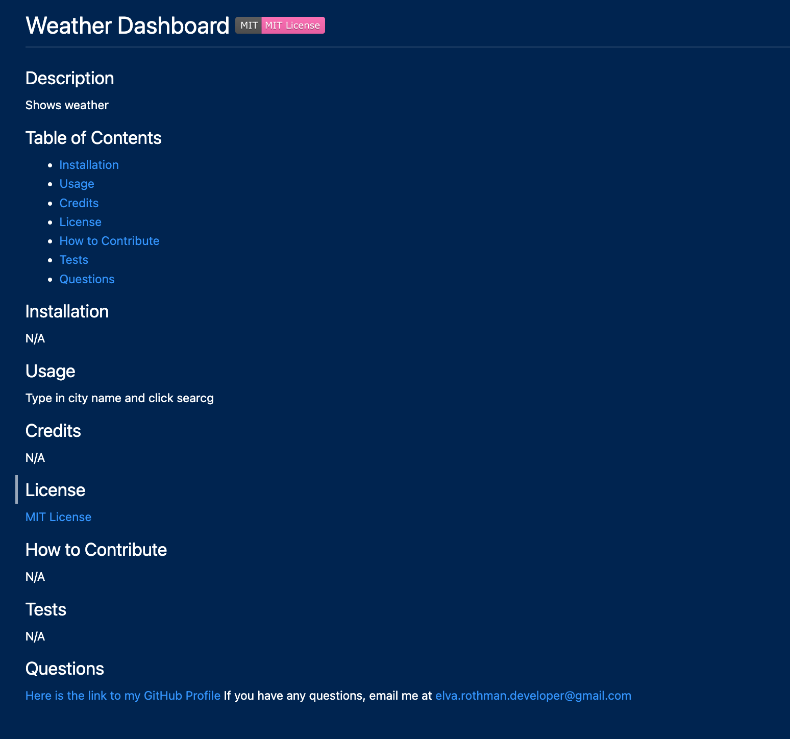

# readme-generator-
  
## Description 
This project allows me to dynamically create a quality README file quickly ande efficiently by using a simple command-line application. Through my time working on this project, I learned how to use NodeJS and Node package managers. I also learned how to incorporate template literals, arrow functions, and const and let instead of var. Along with this, I utilized fs and inquire.

## Usage 
To use this application, you must git clone this repository to your local computer. Navigate to the repository through the terminal. 
Once, you've done that, type in the following command:

```bash
node index.js
```
Here is a video of me walking through the steps to use this application


Here is a screenshot of the README created 


## How to Contribute 
For information on how to contribute or if you have any questions, email me at elva.rothman.developer@gmail.com


